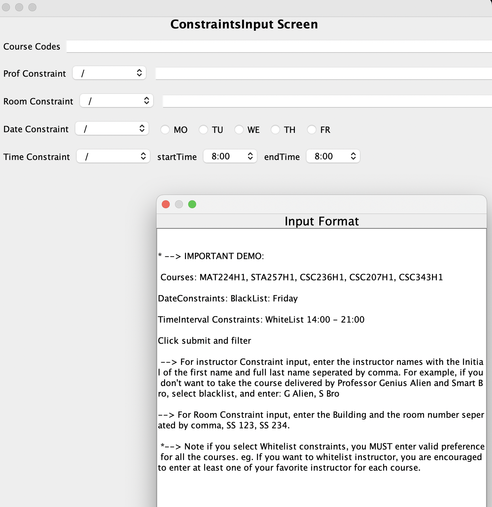

# Timetable Generator
Note: Saved timetables are saved in ```src/main/saved_timetables``` and demo session file is under ```src/main/resources/courses_cleaned.json```.

## Summary of How The Program Works

The Timetable Generator is a program which stores courses on the University of Toronto’s Arts & Science Fall-Winter academic calendar and has the ability to generate and display timetables based on user-inputted requirements and preferences. Timetables can be exported and imported as files. Courses in generated timetables can also be edited, removed, or added through the user interface. The user can also prompt the program to display breadth course sections that match selected breadth categories sorted based on the user's preferred time.


## Organization
We organized the repository by use case, then further divided it by clean architecture layers. Each use case package contains all classes in the Application business Rules layer and contains packages for the Interface adapters layer and Framework & Drivers layer. Outside of the use case packages, there is the entities package containing all entities used in the program.

## Design Decisions
- We use Models that hold data equivalent to those in important Timetable/Session entities, which double as both request models and response models, since many use cases take entire timetables or sessions as inputs and outputs. This allows us to use entity information in our response and request models without making them reliant on the entities. We also created specific view models that are separate from the request and response models to display timetables when necessary.
- **User Case 6**: Used dependency injection, used design pattern similar to builder design, and used observer design pattern and iterator design pattern by implementing Java.Flow from the Java Reactive Streams API.
- **Use Case 3**: Chosen to have the user input an original Timetable to try and 'match' with pre-generated ones instead of trying to generate 2 matching new ones directly from a set of constraints. This limits computational complexity to reasonable levels.
- **Use Case 3**: Implemented Observer design pattern (see below), and made use of Singleton pattern in helper Converter classes that really don’t have a reason to be initialized more than once (for the purpose of screaming architecture, and convenience of access)
- Many of our interactors store timetables and sessions directly, but need to be updated whenever the user navigates between different timetables or when new ones are generated. To update the timetables and sessions, we use the Observer design pattern (implemented as Java.Flow from the Java Reactive Streams API ) since it solves the problem of alerting and updating relevant interactors when the selected timetable is changed.
- Many of our classes avoid instantiating another class using dependency injection pattern to reduce the coupling.
- **Use case 1**: Gave a title to each timetable to the user can keep track of which timetables they already evaluated, reduced preferences options due to complexity reasons.
- **Use case 2**: Used dependency injection for the timetable generation and observer design for the observers.
- **Use case 5**: Maintained Open-Closed principle by implementing factory design pattern for course comparator used for sorting courses based on user’s preferred time. By implementing an interface for the factory, we can add another implementation for comparator without modifying any existing classes.

## Setup Requirements
- The Timetable Generator program is a Gradle project with the default settings given by the default project setup.
JRE or JDK 19 should be installed and usable on the machine.
- Because we used IntelliJ’s built-in Swing GUI designer, please ensure that IntelliJ settings are configured correctly to support its usage.
  - Please make sure Editor → GUI Designer generates GUI into Java Source Code
  - In Build, Execution, Deployment → Build Tools → Gradle, please ensure that we build & run using IntelliJ IDEA and Run tests using IntelliJ IDEA.


## How to use
**To use Use Case 1 (TimeTable Sorter)**:
- Use the scroll bar to browse through possible timetables
- Click a timetable’s title to view it in TimetableUI view
- Click “Main Menu” to return to the MainUI view
- Click “Overlap” to have OverlapInputDialog
- Click “Sort” to get to the sorter
  - Choose your preferences (there are only 2 kinds of preferences each with 3 options that are described on that screen)
  - Click “Submit Input” to return to AllTimetablesScreen with the timetables sorted
  
**To use Use Case 2 (Timetable Generating)**:
- First, access CourseInput Screen
- To get the input format, click the help button.
- Select the Session Type, “S” or “F”.
- Enter Course Code separated by comma (CSC207H1, CSC258H1, CSC236H1)
- At this point, you are able to access use case 7 as well, but for this case the user may press generate
- If a possible timetable is generated, sends the generated timetables to use case 1.

**To use Use Case 3 (Timetable Matching)**:
- First, access the input dialog somehow. Two good options for doing this are through activating the Timetable Generating Use Case 2, and/or through a timeTableUI window (which one can get from trying to view a timetable). Both of these have match buttons, and will allow the user to create an OverlapInputDialog and start the use case.
- The user is presented with a list of timetable options in a ComboBox. The user should choose one of the comboBox options to fix a ‘target timetable’ that they would like to generate a maximally overlapping companion timeTable for.
- A constraints/course input screen then opens. The user should fill out that screen in accordance with the method they would use for use case 2 (see directly above, omitted for brevity).   
- A window with a button to GENERATE A TIMETABLE appears. When the user is ready, they should click that button to see their newly maximally overlapping timeTable in a nice view :).
- Please note 2 things. If you enter the same courses and constraints as the original timetable, you might just get the original timetable back. This was intentional - if you can have the same schedule as your friend, and you want to overlap with them as much as you can, why wouldn’t you? Also, you might get a terribly or non-overlapping timeTable back if we had a hard time making one with your constraints.

**To use Use Case 4**:
- To access the timetable editor UI, one can either import a timetable and click the edit button, or generate a timetable, select the timetable, and open the editor from there.
- There will be buttons below that will immediately remove or edit a given course once pressed (eg. “Remove CSC207”, “Edit CSC207”). There will also be a button on the top of the UI that give options to “Add a course”. The “Add a course” button is used to add a course that isn’t currently in the timetable but is in the session, while the “Edit [Course]” button is used to change the sections of a course in the timetable and in the session.
- Upon pressing the “Add a course” button, the user will be presented a list of courses from the session that are not in the timetable, of which the user can select one and continue.
- The next menu displays all available sections for the course to be added. Multiple sections can be selected by holding shift while clicking each section. Only at most one of each type of section (LEC, PRA or TUT) can be selected, otherwise an error will be displayed.
- Once the user continues forward, the timetable will be updated to include the new course.
- Upon pressing the “Edit [Course]” button, the user will be shown a menu displaying all available sections for the course to be edited, of which the currently used sections are already highlighted. Multiple sections can be selected by holding shift while selecting or deselecting sections. Once the user moves forward, the timetable will be updated to reflect the edited course or display an error.

**To use Use Case 5 (BR Recommendation)**:
 ![Recommend BR2] (src/main/images/RecommendBR2.png)
- First, access timetable editor UI through Use Case 4 (as described above)
- Then click “Recommend BR Courses” button, which opens up popup screen
- Select breadth category(s) that you want in the check box
- Select preferred time (“early”, “balanced”, “late”, and “don’t care”)
- Click “submit input” button to generate list of breadth courses with the current input
- The left half of the screen will display list of breadth courses matching the selected breadth categories with no time conflict with the original timetable, sorted based on the preferred time
- You can select a course on the left to see basic course information on the right half of the screen
- Click “Add Course” button on the right to add the selected course to the original timetable
- The pop up window will be closed and selected course will be added and displayed on the original edit timetable screen

**To use Use Case 6 (File IO/Importing and Exporting Files)**:

- To import a JSON file that holds either courses from a timetable or sessions, use the Import Session or Timetable buttons on the main menu and upload the timetable or session JSON file from your local storage. Session from demo stored in ```src/main/resources/courses_cleaned.json```. 
- To export a timetable as a JSON file, choose the timetable you want to save from the UI that displays a single timetable or displays all timetables and then click on the save button on the UI for the corresponding timetable. The program will then download your timetable onto your local storage in ```src/main/saved_timetables```.

**To use Use Case 7(BlackList/WhiteList: Filtering out Sections of CalendarCourses)**:

- First, access Constraint Input Screen
- To get the input format, click help button.
- Select the Session Type, “S” or “F”..
- Enter Course Code separated by comma (CSC207H1, CSC258H1, CSC236H1)
- For each constraints panel, first select blacklist/whitelist, then enter or select the corresponding Constraints Domain.
- Time and date is used most frequently realistically speaking. If using whitelist, it’s recommended that the user enter all their favorite time or professor for each course, so that the filtering would work more effectively.
- If user does not want to enter any constraint, leave the combobox for “/”,”blacklist”,”whitelist” unchanged. If the program detects the combobox is “/” default option, no matter if the user input constraint or not, it would not be applied. Once finished the selection, click submit and filter 
- If the course input and constraints match, the pop up window will display all the available sections of the input courses. 
- Last, the user just has to click generate timetable, and the following would be UseCase 2(JD generates the timetables and display to the user.).
